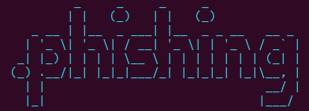

<p align=center>
  <br>
  <a href="" target="_blank"></a>
  <br>
  <span>Compiler that aggregates a variety of login screens for your phishing.</span>
  <br>
</p>

You must use Python 3.9 or higher

## Installation

```console
# clone the repo
$ git clone https://github.com/phishing-project/.phishing

# install the requirements
$ python3 -m pip install -r requirements.txt

# change the working directory to p.phishing
$ cd p.phishing
```


## Start

```console
$ python3 .phishing.py
```

## Disclaimer
The author of this project is not responsible for any misuse or illegal use of this program. It is the user's responsibility to ensure that the use of this program complies with the laws and regulations of their jurisdiction.